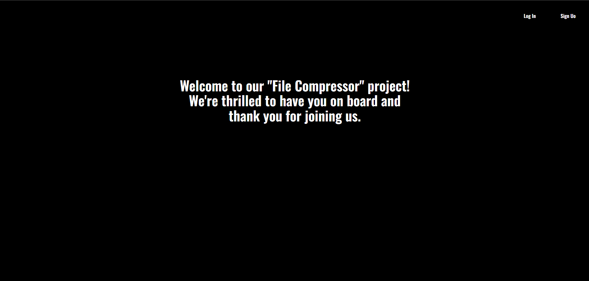

# Название проекта: Compresser

## Краткое описание проекта:
Проект Compresser представляет собой веб-приложение для сжатия изображений. Основной функционал включает загрузку изображений пользователем, их сжатие с использованием алгоритмов сжатия и сохранение сжатых изображений. Целевой аудиторией являются пользователи, которым требуется сжимать изображения для уменьшения размера файлов и улучшения производительности при их загрузке и отображении.

## ФИО участников команды:
- Ботагариев Амирхан
- Жармагамбетов Рустем
- Куттыбаев Даулет
## Скриншоты основных страниц сайта:

## Пошаговая инструкция по запуску проекта:
1. Запуск фронтенда:
   - Перейдите в каталог frontend проекта.
   - Установите зависимости командой `npm install`.
   - Запустите фронтенд командой `npm start`.

2. Запуск бекенда:
   - Убедитесь, что у вас установлен Go и PostgreSQL.
   - Создайте базу данных в PostgreSQL с помощью команды `createdb compresser`.
   - Перейдите в каталог backend проекта.
   - Установите необходимые зависимости командой `go mod tidy`.
   - Запустите бекенд командой `go run main.go`.

3. Использованные инструменты и ссылки на источники:
   - Frontend:npm, HTML/CSS/JavaScript.
   - Backend: Go, Gin framework, Bcrypt, PostgreSQL.
   - Источники:
     - [React.js документация](https://reactjs.org/docs/getting-started.html)
     - [Gin framework документация](https://gin-gonic.com/docs/)
     - [PostgreSQL документация](https://www.postgresql.org/docs/)
